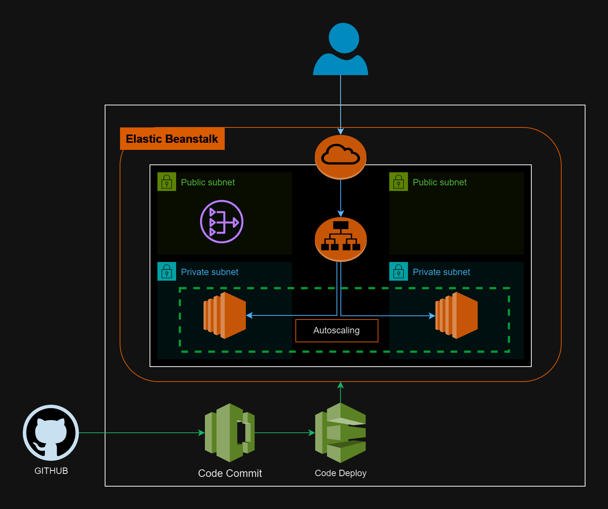

# Multi-Tier Web Application on AWS Elastic Beanstalk

This project deploys a multi-tier web application on AWS Elastic Beanstalk. 


## Technology Stack

* **Infrastructure as Code (IaC):** Terraform
* **AWS Service:** Elastic Beanstalk, VPC, Subnets, Security Groups, IAM roles, EC2 Auto Scaling

## Getting Started

### Prerequisites

1. An AWS account with proper permissions.
2. Terraform installed and configured.
3. Configure the AWS provider in Terraform config file (`main.tf`) with your desired region.

### Deployment

1. Clone this repository.
2. Update the variables file (`vars.tf`) with your specific configuration details.
3. Initialize Terraform:

```bash
terraform init