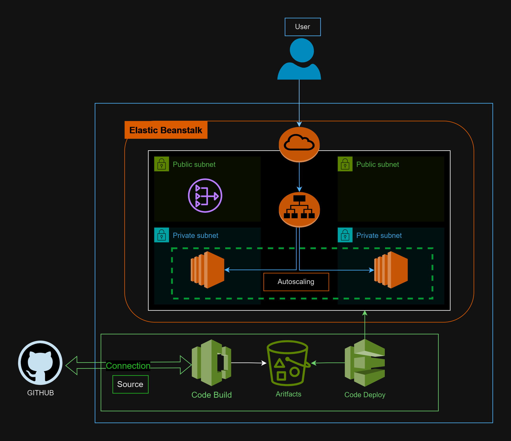

# Multi-Tier Web Application on AWS Elastic Beanstalk


# Terraform Infrastructure Setup

This repository contains Terraform configurations for deploying various AWS services, including CodeBuild, CodePipeline, EC2 Instance Profiles, Elastic Beanstalk, IAM roles, S3 Buckets, and Security Groups. The modules are organized to facilitate reuse and modularity. Below is an overview of each module, along with instructions on how to use them.

## Table of Contents
- [Modules](#modules)
  - [CodeBuild](#codebuild)
  - [CodePipeline](#codepipeline)
  - [EC2 Instance Profile](#ec2-instance-profile)
  - [Elastic Beanstalk](#elastic-beanstalk)
  - [IAM Role for CodePipeline](#iam-role-for-codepipeline)
  - [IAM Role for CodeBuild](#iam-role-for-codebuild)
  - [S3 Pipeline](#s3-pipeline)
  - [Security Group](#security-group)
- [Usage](#usage)
- [Variables](#variables)
- [Outputs](#outputs)
- [Prerequisites](#prerequisites)

## Modules

### CodeBuild
This module provisions an AWS CodeBuild project for building applications.

- **Path:** `modules/code_build`
- **Main Resource:** `aws_codebuild_project`
- **Inputs:** `name`, `role_arn`
- **Outputs:** `codebuildname`

### CodePipeline
This module sets up an AWS CodePipeline, which includes stages for Source, Build, and Deploy.

- **Path:** `modules/code_pipeline`
- **Main Resource:** `aws_codepipeline`
- **Inputs:** `name`, `pipeline_arn`, `s3_bucket`, `FullRepositoryId`, `BranchName`, `ConnectionArn`, `BuildProjectName`, `Provider`, `EnvironmentName`

### EC2 Instance Profile
This module creates an EC2 instance profile and an associated IAM role, required by Elastic Beanstalk environments.

- **Path:** `modules/ec2_instance_profile`
- **Main Resources:** `aws_iam_role`, `aws_iam_instance_profile`
- **Inputs:** `instance_profle_RoleName`, `aws_iam_instance_profile_name`
- **Outputs:** `instance_profile_name`

### Elastic Beanstalk
This module sets up an Elastic Beanstalk application and environment, along with necessary configurations.

- **Path:** `modules/elasticBeanstalk`
- **Main Resources:** `aws_elastic_beanstalk_application`, `aws_elastic_beanstalk_environment`
- **Inputs:** `application_name`, `environment_name`, `solution_stack_name`, `instance_type`, `health_check_path`, `min_instance_count`, `max_instance_count`, `vpc_id`, `private_subnet_ids`, `public_subnet_ids`, `elb_scheme`, `security_group_id`, `instance_profile_role_arn`

### IAM Role for CodePipeline
This module creates an IAM role for CodePipeline with the required policies.

- **Path:** `modules/iam_codepipeline`
- **Main Resources:** `aws_iam_role`, `aws_iam_role_policy`
- **Inputs:** `name`
- **Outputs:** `codepipeline_role_arn`

### IAM Role for CodeBuild
This module provisions an IAM role for CodeBuild with necessary permissions.

- **Path:** `modules/IAM_Role_CodeBuild`
- **Main Resources:** `aws_iam_role`, `aws_iam_role_policy_attachment`, `aws_iam_role_policy`
- **Inputs:** `role_name`
- **Outputs:** `codebuild_role_arn`

### S3 Pipeline
This module creates an S3 bucket for storing pipeline artifacts along with an S3 bucket policy.

- **Path:** `modules/s3_pipeline`
- **Main Resources:** `aws_s3_bucket`, `aws_s3_bucket_policy`
- **Inputs:** `bucket_name`
- **Outputs:** `s3_bucket`

### Security Group
This module provisions a security group with customizable ingress and egress rules.

- **Path:** `modules/security_group`
- **Main Resource:** `aws_security_group`
- **Inputs:** `name`, `description`, `vpc_id`, `ingress_rules`, `egress_rules`

## Usage
To use these modules in your Terraform configuration, include the desired module and provide the required variables. Here’s an example:

```hcl
module "codebuild" {
  source = "./modules/code_build"
  name   = "my-codebuild-project"
  role_arn = "arn:aws:iam::123456789012:role/CodeBuildRole"
}
```
### Variables
Each module has its own set of variables defined in variables.tf. Ensure you provide the necessary values for these variables when using the module.

For example, in modules/code_build/variables.tf, the name variable is required for naming the CodeBuild project.

# Prerequisites
1. Github connection which you have to create manually using aws console as it needs to authenticate to your GitHub account
2. Add a buildspec.yaml file in root folder of your repository 

```yaml

version: 0.2

phases:
  install:
    runtime-versions:
      dotnet: 8.0
    commands:
      - echo "Installing .NET Core 8.0"

  pre_build:
    commands:
      - echo "Restoring .NET packages"
      - dotnet restore  WebApplication1.sln || exit 1

  build:
    commands:
      - echo "Building the .NET application"
      - dotnet build WebApplication1.sln --configuration Release || exit 1
      - echo "Publishing the .NET application"
      - dotnet publish WebApplication1/WebApplication1.csproj --configuration Release --output ./output || exit 1

  post_build:
    commands:
      - echo "Zipping the output files"
      - zip -r output.zip ./output || exit 1
      - echo "Copying files to S3"
      - aws s3 cp output.zip s3://webapplication1-artifacts-bucket/output.zip || exit 1

artifacts:
  files:
    - output/**
  discard-paths: yes

  ```

  ## .NetFramework Repository
  https://github.com/KaramHussain/WebApplication1